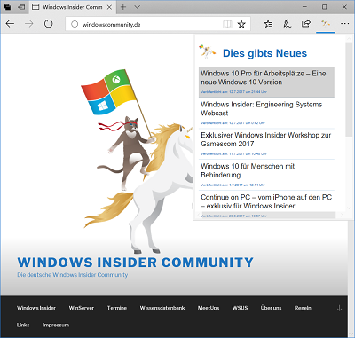

# Microsoft Edge Extension for windowscommunity.de

## What is it?
These bunch lines of code are a simple extension for Microsoft's Edge browser that provides an overview of the latest blog articles (German) on [windowscommunity.de](http://windowscommunity.de) - the German WINsider community.

## Why does it exists?
First, there is no Edge extension for this awesome community. Sencond, I wanted to fiddle around with some JavaScript after years of ignoring it.

## Limitation
This is just a more a rough sketch than a productive and beautiful Edge extension. I've plans to keep this tiny project ongoing but it is not my main focus to ship it to the general public.

## Usage
1. You have to use a Windows 10 with Anniversary Update or later.
2. Download or clone the repository
3. If you wanna use it more than once, extract / move it into a save folder on your machine
4. Check `Enable extension developer features` in [about:flags](about:flags)
5. Side load extension via Settings -> Extensions -> "Load extension" button
6. Et voila, you are now able to click on the NinjaCat on the right side of your search bar

## Fork it, make it better - but explain it to me
Feel free to change, fix or enhance the extension. But please explain / teach me what and why do you changed the source. I wanna learn and improve my self.

## License
It's MIT licensed. I have no ownerhsip or something else of the cute NinjaCat.